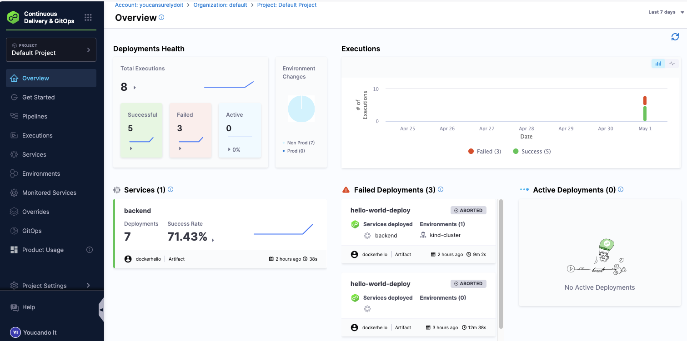
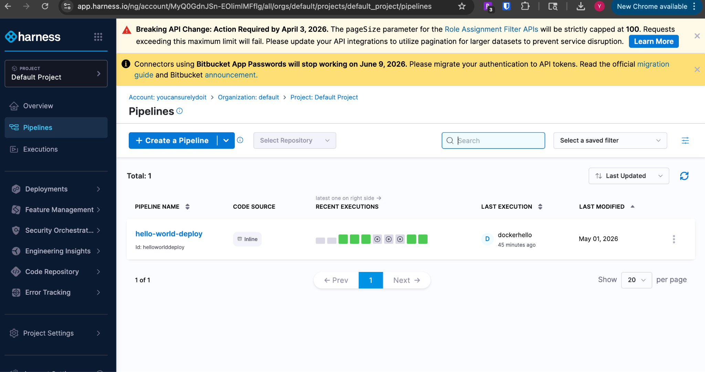
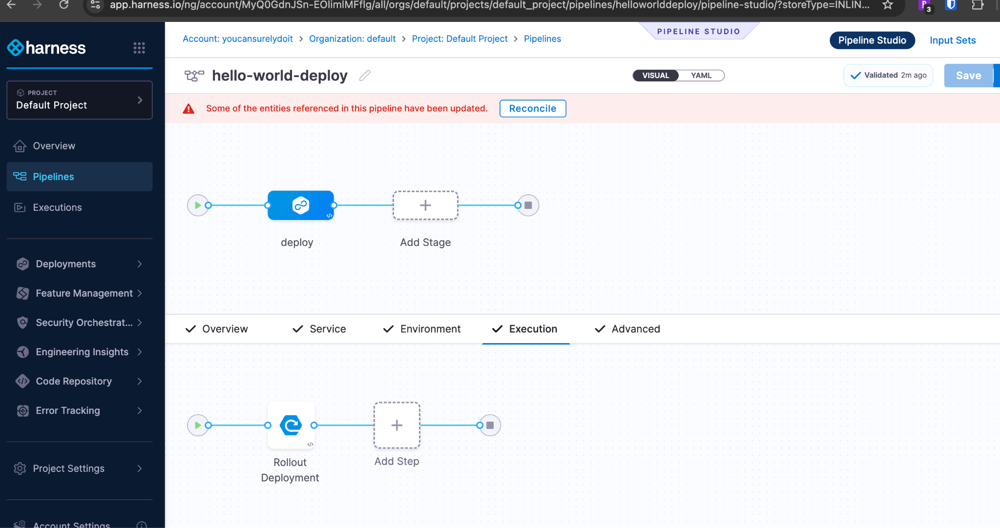
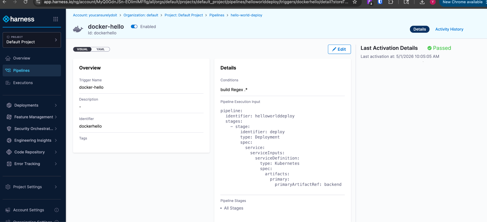
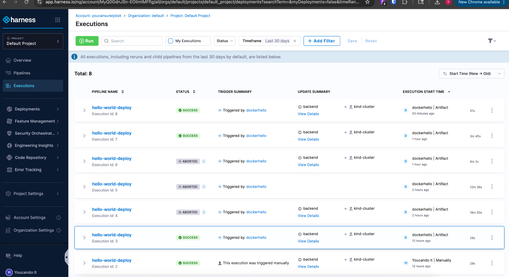
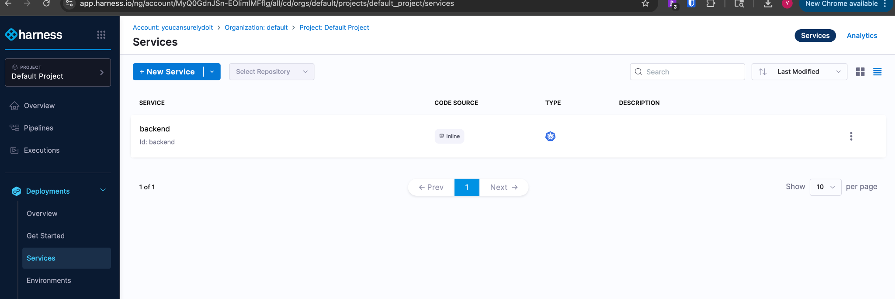
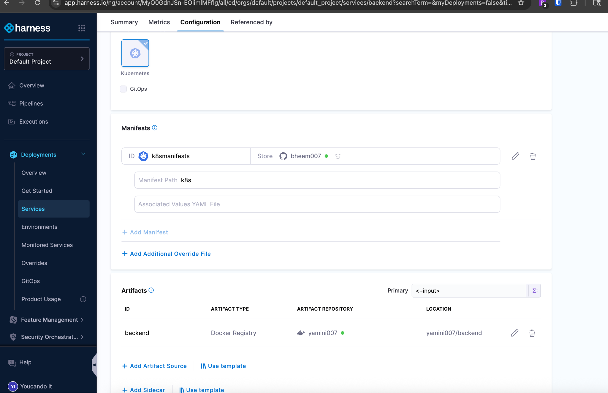
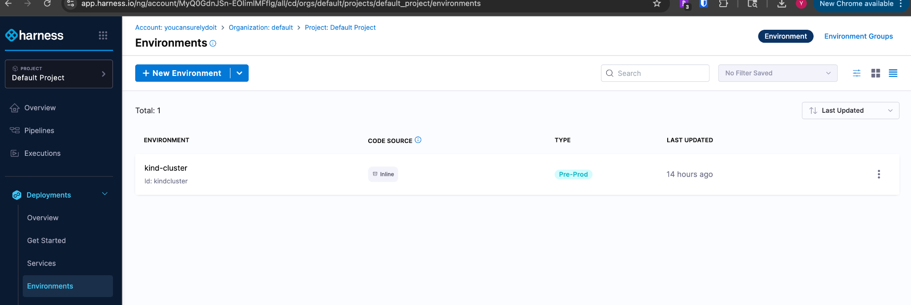
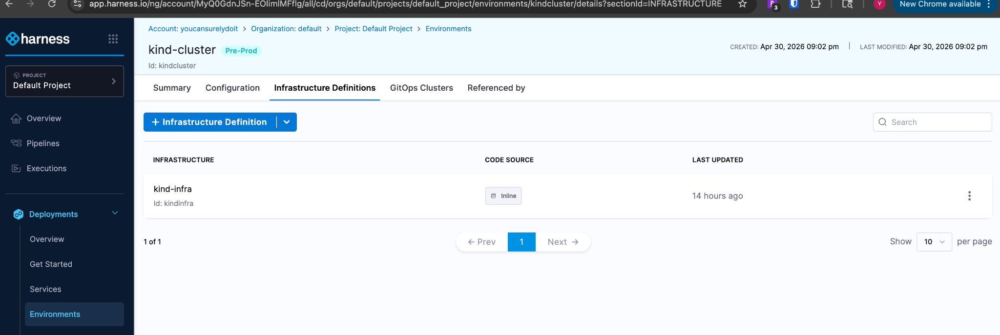

This Repo describes the end-to-end CI/CD pipeline built for a Python microservices application deployed on a homelab server running a Kind cluster. The pipeline automates building, pushing, and deploying three services using GitHub Actions for CI and Harness for CD.

The main steps:

Developer pushes code to GitHub (main branch)
GitHub Actions builds Docker images for all services
Images are pushed to Docker Hub 
Harness detects the new artifact via an Artifact trigger
Harness fetches Kubernetes manifests from GitHub
Harness deploys to the Kind cluster on the homelab server

Pipeline Flow

